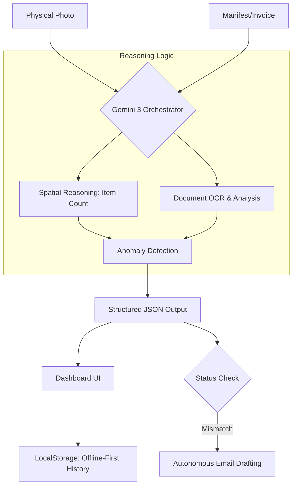

<div align="center">


# 📦 LogiAudit AI
**Autonomous Logistics Guardkeeper: Bridging the Physical-Digital Gap with Gemini 3 Multimodal Orchestration**

[](https://aistudio.google.com/)
[](https://opensource.org/licenses/MIT)

[📺 Watch Demo Video](https://youtu.be/nTrh5urmvwQ) | [🚀 View in AI Studio](https://ai.studio/apps/drive/1P_zOMnk95lcx07kCavl5M2OORL_Rg71P)
</div>

---

## 🌟 Overview
**LogiAudit AI** leverages Gemini 3’s **Native Multimodal Reasoning** to automate the traditionally error-prone manual logistics audit. It performs **Cross-Modal Analysis**, simultaneously reasoning over physical cargo photographs and shipping manifests to ensure supply chain integrity.

## 🧠 Key Features & Gemini Integration
- **🧩 Spatial Reasoning**: Executes intelligent item counting (e.g., 6x6 grid patterns in fruit crates) instead of simple object detection.
- **🤖 Autonomous Action**: Automatically generates professional "Complaint Email Drafts" when a mismatch is detected, including precise Invoice IDs and discrepancy counts.
- **🛡️ AI Gatekeeper (Self-Correction)**: Intelligently flags blurry or low-quality images to prevent data hallucinations, requesting a retake when necessary.
- **📄 Advanced OCR**: Seamlessly extracts and cross-references data from complex shipping documents.

## 🏗️ Architecture


## 🛠️ Tech Stack
- **Framework**: React.js
- **AI Engine**: Gemini 3 API (Multimodal, Spatial Reasoning, Structured Output)
- **State/Data**: Offline-First via LocalStorage
- **Deployment / Prototype**: Google AI Studio App

## 🚀 Getting Started
**Prerequisites**: Node.js (v18+)
1. **Clone the repo:**
```
   git clone [https://github.com/tarqhilmarsiregar/logiaudit-ai.git](https://github.com/tarqhilmarsiregar/logiaudit-ai.git)
   cd logiaudit-ai
```

2. **Install dependencies:**
```
   npm install
```

3. **Environment Setup:** Create a `.env.local` file and add your Gemini API Key:
```
   GEMINI_API_KEY=your_api_key_here
```

4. **Run Development Server:**
```
   npm run dev
```